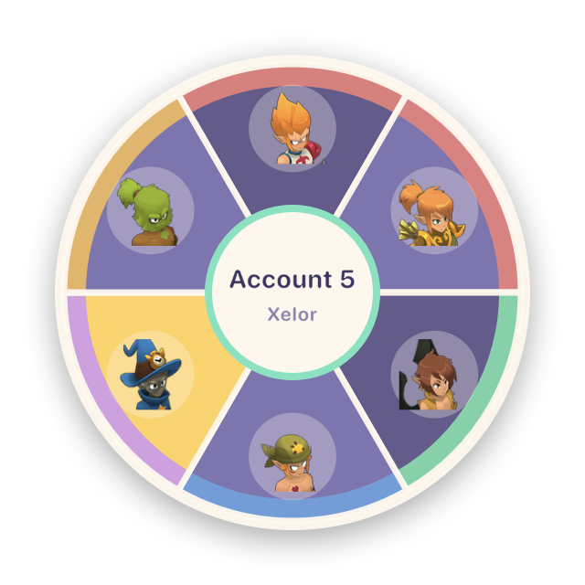
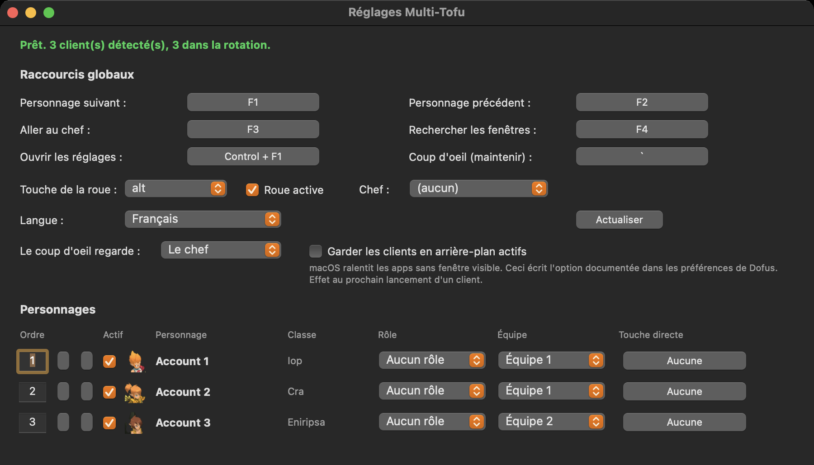

# Multi-Tofu

Outil multicompte Dofus pour macOS. Bascule instantanée entre vos clients, roue
des personnages, gestion d'équipes, pour Dofus 3 (Unity).

**[Site](https://minutesback.github.io/multi-tofu/fr/)** · **[English](README.md)** · **Français** · **[Español](README.es.md)** · **[Português](README.pt.md)**

Portage macOS indépendant de [Dosoft](https://www.dosoft.fr), qui n'existe que
sous Windows. Aucun code Windows n'est réutilisable, il repose sur l'API Win32,
donc tout est réécrit sur l'API d'Accessibilité macOS, un CGEventTap et AppKit.

<p align="center">
  
</p>



## Ce que ça fait

- **Bascule instantanée.** Des raccourcis globaux passent au client suivant ou
  précédent, ou reviennent directement sur votre chef d'équipe.
- **Roue des personnages.** Maintenez Option, une roue apparaît sous le curseur
  avec l'icône de classe de chaque personnage. Bougez la souris, relâchez, le
  client est au premier plan.
- **Équipes.** Répartissez vos personnages et ne tournez que dans l'équipe
  active.
- **Touches directes.** Une touche fixe par personnage.
- **Barre des menus.** Cliquez un personnage pour l'afficher, changez de
  rotation, ouvrez les réglages.
- **Quatre langues.** Anglais, français, espagnol et portugais, calées sur votre
  système au premier lancement et modifiables à tout moment.
- **Rôles.** Marquez chaque personnage et la roue colore sa part en conséquence.
  Au-delà de cinq clients, on lit une couleur plus vite que six noms.
- **Coup d'oeil.** Maintenez une touche pour regarder un autre client, relâchez
  et vous revenez où vous étiez, place dans la rotation comprise.
- **Ordre au clavier.** Tapez un numéro pour placer un personnage, pratique
  quand l'ordre suit l'initiative et non l'ordre d'ouverture des clients.
- **Reste discret.** Il ouvre les réglages la première fois pour l'installation,
  puis se fait oublier dans la barre de menus. Une fois lancé il ne revient pas
  au premier plan, même quand le Launcher Ankama le relance.
- **Une touche, une action.** Attribuer une touche déjà prise la libère chez
  l'autre action, plutôt que d'en laisser une qui ne se déclenche jamais.
- **Seul le client où vous êtes.** Activez le masquage et tous les autres
  clients disparaissent pendant que vous jouez celui du dessus. Ils continuent
  de tourner et reviennent dès que vous passez dessus.

## Où sont enregistrés vos réglages

Tout ce que vous configurez est écrit dans
`~/Library/Application Support/Multi-Tofu/config.json` dès que vous le changez,
indexé par nom de personnage. Ordre de rotation, équipes, rôles, chef, touches
directes et tous les raccourcis. Fermez les clients, fermez l'app, revenez une
semaine plus tard, connectez les mêmes personnages et tout est comme vous
l'aviez laissé.

Les icônes de classe sont lues dans le jeu, pas devinées. Le titre de la fenêtre
porte la classe, donc un Eniripsa affiche l'icône Eniripsa sans rien lui dire.
La dernière classe connue est mémorisée par personnage, donc un client encore en
chargement affiche déjà la bonne.

## Le nom des personnages

Vous ne les saisissez pas. Multi-Tofu lit le titre de la fenêtre Dofus, donc dès
qu'un personnage se connecte son vrai nom apparaît dans la roue, dans le menu et
dans les réglages.

Un client ouvert mais resté sur l'écran de connexion n'a pas encore de
personnage, il s'affiche donc en `Compte 1`, `Compte 2` et ainsi de suite. Ces
entrées restent visibles dans le menu, où vous pouvez cliquer pour aller vous
connecter, mais elles sont exclues de la rotation F1 pour qu'une touche ne vous
envoie jamais sur une fenêtre sans personnage. Passez
`login_windows_in_rotation` à true pour les inclure.

## Installation

Téléchargez le `.zip` depuis la page
[Releases](https://github.com/MinutesBack/multi-tofu/releases), décompressez-le et
glissez `Multi-Tofu.app` dans Applications.

L'app n'est pas signée par un compte développeur Apple, donc au premier
lancement faites un clic droit sur l'icône puis **Ouvrir**, et confirmez. Si
macOS refuse quand même, allez dans Réglages Système > Confidentialité et
sécurité et cliquez **Ouvrir quand même**.

Universelle, elle tourne sur Apple Silicon comme sur Intel.

## Autorisation d'Accessibilité

Au premier lancement macOS demande l'Accessibilité. Multi-Tofu en a besoin pour
lire le titre des fenêtres Dofus et pour écouter vos raccourcis.

Réglages Système > Confidentialité et sécurité > Accessibilité, puis activez
Multi-Tofu. Inutile de quitter, les raccourcis s'activent seuls en quelques
secondes.

Pas d'icône dans le Dock par défaut, l'app vit dans la barre des menus. Si votre
barre des menus est pleine, macOS cache l'icône derrière l'encoche, l'app le
détecte et vous propose une icône dans le Dock à la place.

## Raccourcis par défaut

| Action | Touche |
| --- | --- |
| Personnage suivant | F1 |
| Personnage précédent | F2 |
| Aller au chef | F3 |
| Rechercher les fenêtres | F4 |
| Roue des personnages | maintenir Option |
| Coup d'oeil sur un autre client | maintenir ² |
| Ouvrir les réglages | Control + F1 |

Tout est modifiable dans les réglages. Les raccourcis sont enregistrés comme
codes de touches physiques, ils survivent donc à un passage AZERTY vers QWERTY.

## Depuis les sources

```
git clone https://github.com/MinutesBack/multi-tofu.git
cd multi-tofu
python3 -m venv .venv
./.venv/bin/pip install -r requirements.txt
./run.sh
```

Lancez depuis Terminal.app et autorisez Terminal dans l'Accessibilité, ou
construisez l'app avec `./tools/build_app.sh --install` et autorisez Multi-Tofu.

`./run.sh --probe` affiche ce que l'app détecte.

## Configuration

`~/Library/Application Support/Multi-Tofu/config.json`

- `language` : auto, en, fr, es ou pt.
- `login_windows_in_rotation` : inclure ou non les fenêtres de connexion.
- `wheel_delay_ms` : durée d'appui sur Option avant l'apparition de la roue.
- `swallow_bound_keys` : empêcher les touches liées d'atteindre Dofus.
- `show_dock_icon` : afficher une icône dans le Dock.

## Limites connues

- **Plein écran.** La roue est une surcouche. Au-dessus d'un client en plein
  écran exclusif elle peut ne pas s'afficher. Jouez en fenêtré ou sans bordure.
- **L'Autofocus Rétro n'est pas porté.** Il lit les notifications toast de
  Windows, macOS n'a pas d'équivalent accessible à une app tierce.
- **Dofus Rétro n'est pas encore géré.** Unity uniquement.

## Licence

Apache 2.0, voir [LICENSE](LICENSE) et [NOTICE](NOTICE).

Multi-Tofu n'est ni affilié à Ankama Games, ni approuvé ni sponsorisé par eux.
DOFUS et tous les noms et visuels associés appartiennent à Ankama Games.
