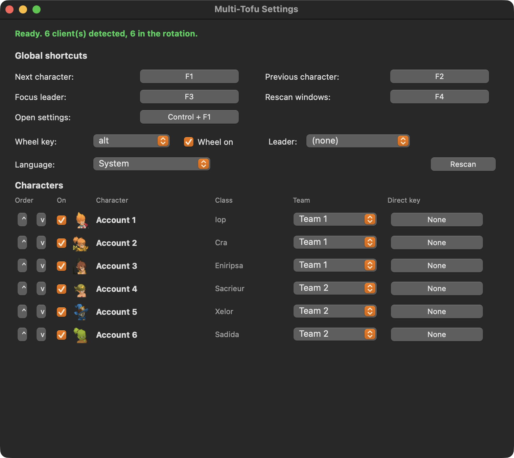

# Multi-Tofu

Gerenciador multiconta de Dofus para macOS. Troca instantânea entre clientes,
roda de personagens e times, para Dofus 3 (Unity).

**[English](README.md)** · **[Français](README.fr.md)** · **[Español](README.es.md)** · **Português**

Port independente para macOS do [Dosoft](https://www.dosoft.fr), que só existe
no Windows. Nada do código Windows aproveita, ele é feito sobre a API Win32,
então tudo foi reescrito sobre a API de Acessibilidade do macOS, um CGEventTap e
o AppKit.

<p align="center">
  
</p>



## O que faz

- **Troca instantânea.** Atalhos globais passam para o cliente seguinte ou
  anterior, ou voltam direto para o seu líder.
- **Roda de personagens.** Segure Option, uma roda aparece no cursor com o
  ícone de classe de cada personagem. Mova o mouse, solte, aquele cliente vem
  para a frente.
- **Times.** Divida seus personagens e gire apenas dentro do time ativo.
- **Teclas diretas.** Uma tecla fixa por personagem.
- **Barra de menus.** Clique num personagem para trazê-lo à frente, troque de
  rotação, abra os ajustes.
- **Quatro idiomas.** Inglês, francês, espanhol e português, seguindo o sistema
  no primeiro início e trocáveis a qualquer momento.

## Os nomes dos personagens

Você não digita nada. O Multi-Tofu lê o título da janela do Dofus, então assim
que um personagem entra o nome real dele aparece na roda, no menu e nos ajustes.

Um cliente aberto mas ainda na tela de login não tem personagem, então aparece
como `Conta 1`, `Conta 2` e assim por diante. Essas entradas continuam visíveis
no menu, onde você pode clicar para ir fazer login, mas ficam fora da rotação do
F1 para que uma tecla nunca leve você a uma janela sem personagem. Coloque
`login_windows_in_rotation` em true para incluí-las.

## Instalação

Baixe o `.zip` na página de
[Releases](https://github.com/JMax92/multi-tofu/releases), descompacte e
arraste `Multi-Tofu.app` para Aplicativos.

O app não é assinado com uma conta de desenvolvedor da Apple, então na primeira
vez clique com o botão direito no ícone e escolha **Abrir**, depois confirme. Se
o macOS ainda recusar, vá em Ajustes do Sistema > Privacidade e segurança e
clique em **Abrir mesmo assim**.

É universal, roda em Apple Silicon e em Intel.

## Permissão de Acessibilidade

No primeiro início o macOS pede Acessibilidade. O Multi-Tofu precisa dela para
ler os títulos das janelas do Dofus e para escutar seus atalhos.

Ajustes do Sistema > Privacidade e segurança > Acessibilidade, e ative o
Multi-Tofu. Não precisa sair, os atalhos ligam sozinhos em alguns segundos.

Sem ícone no Dock por padrão, o app fica na barra de menus. Se a sua barra
estiver cheia, o macOS esconde o ícone atrás do entalhe, o app detecta isso e
oferece um ícone no Dock.

## Atalhos padrão

| Ação | Tecla |
| --- | --- |
| Próximo personagem | F1 |
| Personagem anterior | F2 |
| Ir para o líder | F3 |
| Procurar janelas | F4 |
| Roda de personagens | segurar Option |
| Abrir ajustes | Control + F1 |

Tudo pode ser trocado nos ajustes. Os atalhos são gravados como códigos de tecla
física, então sobrevivem a uma troca entre AZERTY e QWERTY.

## A partir do código

```
git clone https://github.com/JMax92/multi-tofu.git
cd multi-tofu
python3 -m venv .venv
./.venv/bin/pip install -r requirements.txt
./run.sh
```

Rode pelo Terminal.app e autorize o Terminal na Acessibilidade, ou compile o app
com `./tools/build_app.sh --install` e autorize o Multi-Tofu.

`./run.sh --probe` mostra o que o app está detectando.

## Configuração

`~/Library/Application Support/Multi-Tofu/config.json`

- `language`: auto, en, fr, es ou pt.
- `login_windows_in_rotation`: incluir ou não as janelas de login.
- `wheel_delay_ms`: quanto tempo segurar Option antes da roda aparecer.
- `swallow_bound_keys`: impedir que as teclas atribuídas cheguem ao Dofus.
- `show_dock_icon`: mostrar um ícone no Dock.

## Limitações conhecidas

- **Tela cheia.** A roda é uma camada sobreposta. Sobre um cliente em tela cheia
  exclusiva ela pode não ser desenhada. Jogue em janela ou sem bordas.
- **O Autofocus do Retro não foi portado.** Ele lê as notificações toast do
  Windows e o macOS não tem equivalente para um app de terceiros.
- **Dofus Retro ainda não é suportado.** Somente Unity.

## Licença

Apache 2.0, veja [LICENSE](LICENSE) e [NOTICE](NOTICE).

O Multi-Tofu não é afiliado, endossado nem patrocinado pela Ankama Games. DOFUS
e todos os nomes e imagens relacionados são propriedade da Ankama Games.
